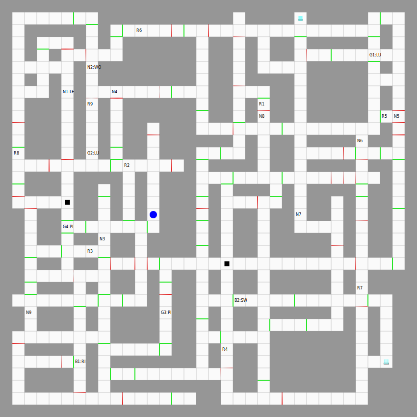
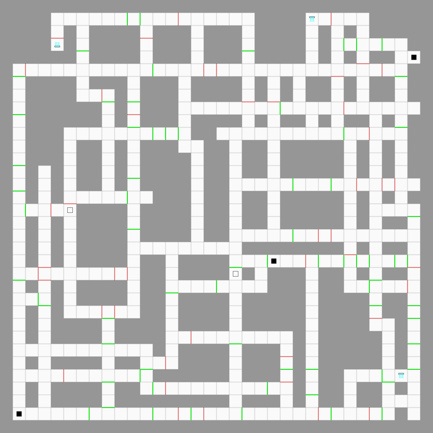
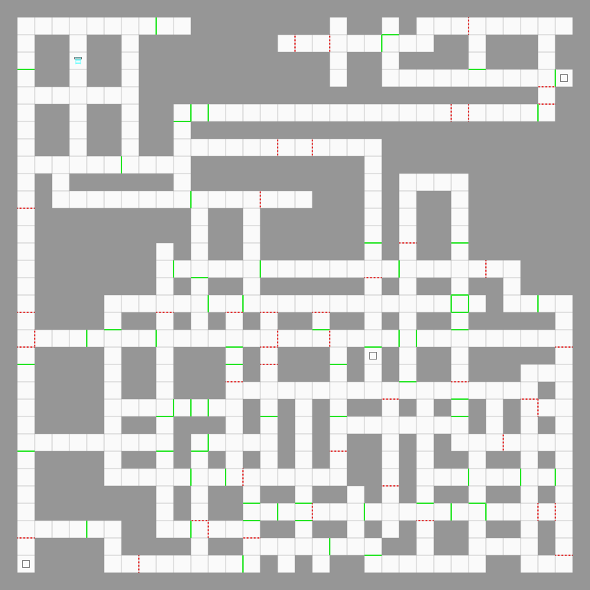
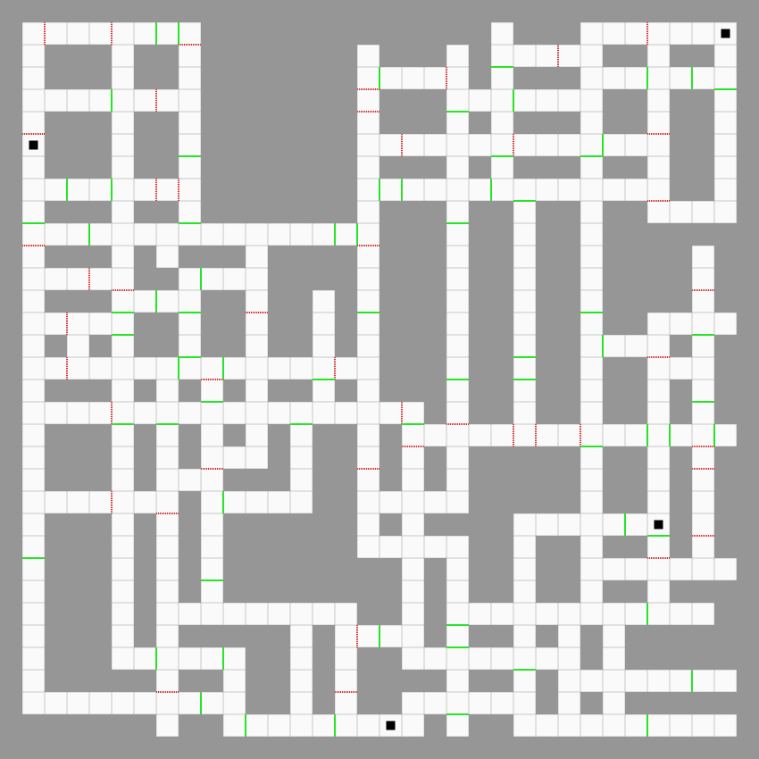
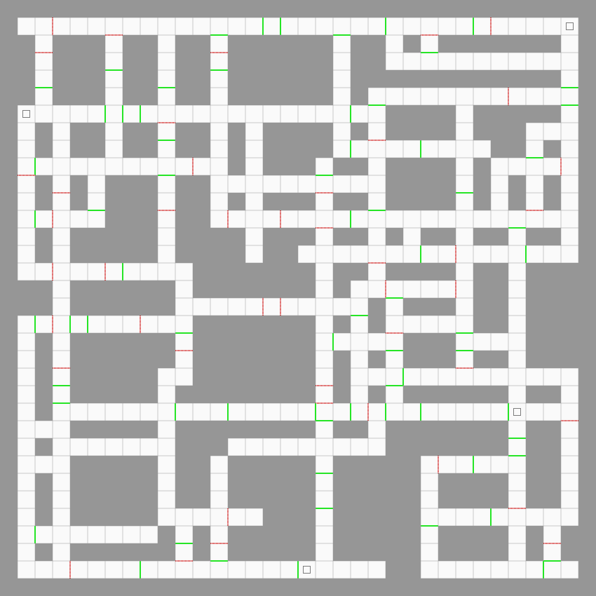

 

# Source

Original: <https://www.computerarcheology.com/CoCo/Daggorath/Levels.html>

# Level Maps

## Level 1

When you start the game the creatures on level-one will start off as shown on the map below. After that, creatures will be randomized on each new level.

The map shows the creatures and what they carry (if anything). For instance, "B1:RI" is "Blob 1 carrying the RING". And "N2:WO" is "sNake 2 carrying the WOODEN SWORD".

"B" for BLOB. "G" for Giant. "N" for SNAKE". And "R" for SPIDER.

The blue dot shows the player's starting position. The player always starts out facing up (north).

The map shows holes leading down as solid black squares. Holes in the ceiling are open squares. Ladders have either a hole in the floor (going down) or a hole in the ceiling (going up).

## Level 2

## Level 3

## Level 4

When you kill the DEMON on level-3 you will be transported to this map in a random square but facing the same way you were before transport.

## Level 5

